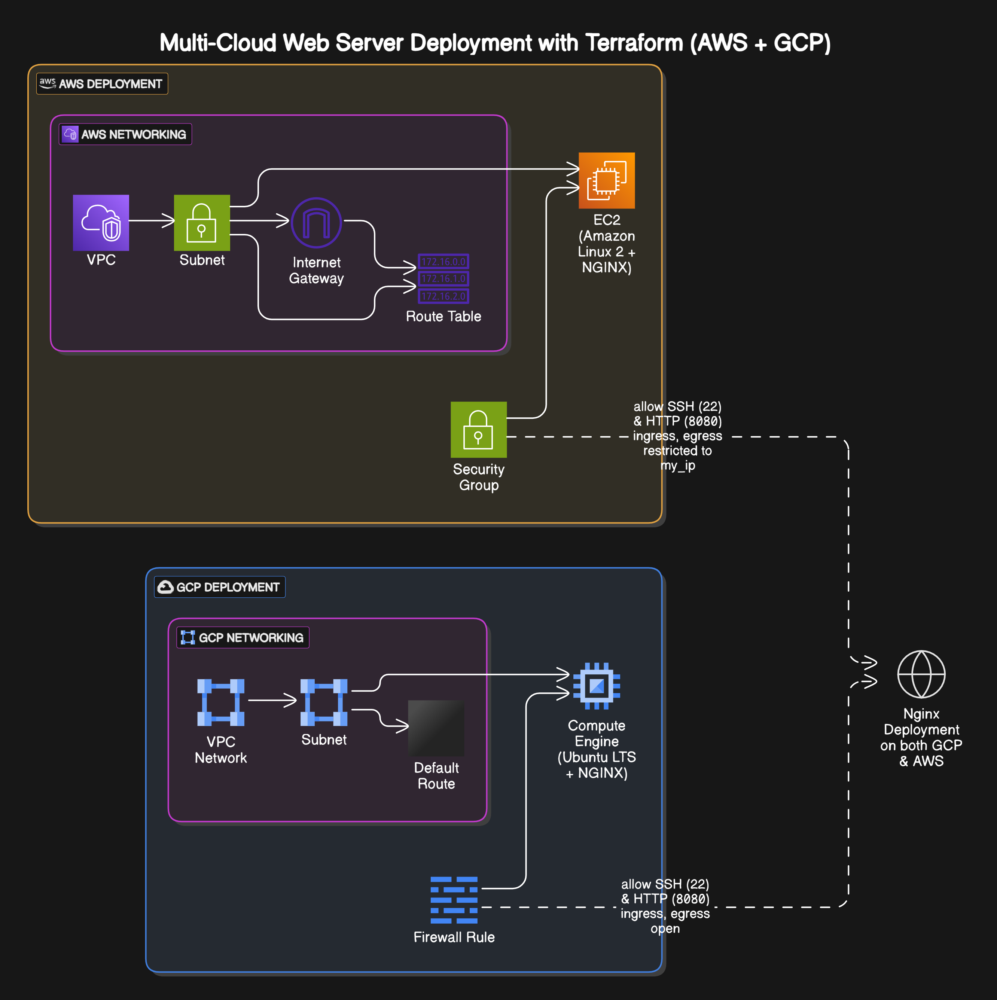
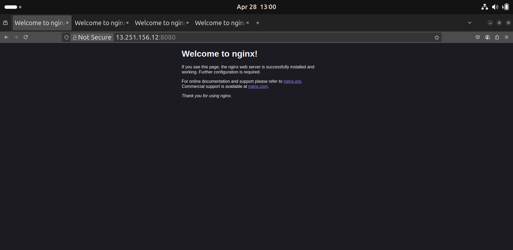
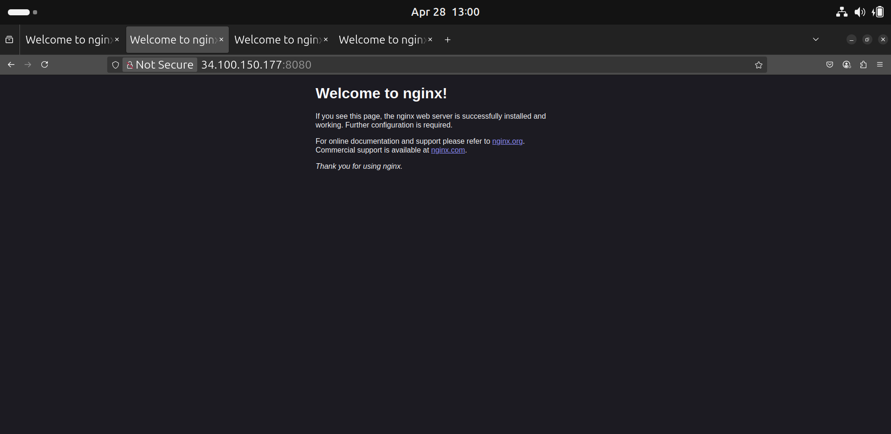
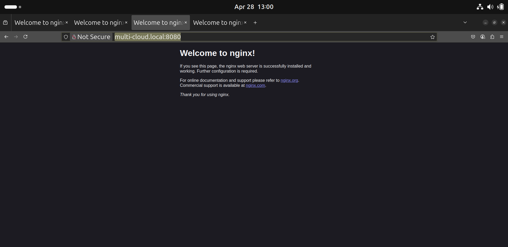

# Multi-Cloud Web Server Deployment using Terraform (AWS + GCP)

## Objective

This project demonstrates the automated provisioning of web server infrastructure across two major cloud providers, Amazon Web Services (AWS) and Google Cloud Platform (GCP), using Terraform. The goal is to deploy NGINX web servers on both platforms and validate the setup efficiently.

## Architecture Overview

The infrastructure consists of the following components deployed in parallel on both AWS and GCP:

1. **Networking:** A custom Virtual Private Cloud (VPC) on AWS and a VPC Network on GCP, each with a dedicated subnet. Internet Gateways and Route Tables (AWS) or default routes (GCP) are configured for internet access.
2. **Compute:** One EC2 instance on AWS and one Compute Engine instance on GCP, running Amazon Linux 2 and Ubuntu LTS respectively.
3. **Security:** Security Groups (AWS) and Firewall Rules (GCP) are configured to allow:
   - SSH access (TCP port 22) only from a specified IP address (`my_ip` variable).
   - HTTP access (TCP port 8080) only from a specified IP address (`my_ip` variable).
   - All egress traffic (restricted to `my_ip` in the provided AWS config, fully open in GCP config).
4. **Web Server:** NGINX is automatically installed and started on both instances using startup scripts (`entry-script.sh` for AWS, `startup-script.sh` for GCP). NGINX listens on port **8080**.

**Infrastructure Diagram** 


## Technologies Used

- **Infrastructure as Code:** Terraform
- **Cloud Providers:**
  - Amazon Web Services (AWS) - Free Tier eligible
  - Google Cloud Platform (GCP) - Free Tier eligible
- **Web Server:** NGINX
- **Operating Systems:** Amazon Linux 2 (AWS), Ubuntu LTS (GCP)
- **Scripting:** Bash (for deployment/cleanup and instance startup)

## Project Structure

```
.
├── apply-script.sh       # Script to deploy infrastructure on both clouds
├── destroy-script.sh     # Script to destroy infrastructure on both clouds
├── aws/                  # AWS specific resources
│   ├── entry-script.sh   # Startup script for AWS EC2 instance (installs NGINX)
│   ├── main.tf           # AWS resource definitions
│   ├── providers.tf      # AWS provider configuration
│   └── terraform.tfvars  # AWS variable values (User configured)
├── gcp/                  # GCP specific resources
    ├── main.tf           # GCP resource definitions
    ├── providers.tf      # GCP provider configuration
    ├── service_account/
    │   └── keys.json     # GCP Service Account Key (User configured)
    ├── startup-script.sh # Startup script for GCP instance (installs NGINX)
    └── terraform.tfvars  # GCP variable values (User configured)
```

## Prerequisites

Before running the deployment, ensure you have the following installed and configured:

1. **Terraform CLI:** [Install Terraform](https://learn.hashicorp.com/tutorials/terraform/install-cli)
2. **AWS Account & Credentials:**
   - AWS account (Free Tier eligible)
   - AWS CLI installed and configured (`aws configure`)
   - SSH Key Pair in AWS (public key file path for `terraform.tfvars`)
3. **GCP Account & Credentials:**
   - GCP account (Free Tier eligible)
   - Google Cloud SDK installed and authenticated (`gcloud auth login` / `gcloud config set project YOUR_PROJECT_ID`)
   - GCP Service Account with Compute Admin role and its key file at `gcp/service_account/keys.json`
4. **Git (Optional):** To clone this repository

## Configuration

1. **Clone the Repository (Optional):**
   ```bash
   git clone <your-repository-url>
   cd multi-cloud-deployment
   ```
2. **Configure AWS Variables:** Edit `aws/terraform.tfvars` for VPC CIDR, subnet CIDR, availability zone, `env_prefix`, `my_ip`, `instance_type`, and `public_key_location`.
3. **Configure GCP Variables:** Edit `gcp/terraform.tfvars` for subnet CIDR, `env_prefix`, `my_ip`, `machine_type`, `private_key_location`, and `ssh_username`. Place your GCP service account key in `gcp/service_account/keys.json`.
4. **Modify /etc/hosts for Local Domain Access:**
   - Open `/etc/hosts` with sudo privileges.
   - Add an entry mapping the deployed instance IP to `multi-cloud.local`:
     ```bash
     sudo nano /etc/hosts
     # Replace <INSTANCE_IP> with the actual output IP
     <INSTANCE_IP> multi-cloud.local
     ```
   - After this, you can access the application at:
     ```
     http://multi-cloud.local:8080
     ```

## Deployment

Use the provided `apply-script.sh` to deploy both AWS and GCP configurations sequentially:

1. **Make it executable:**
   ```bash
   chmod +x apply-script.sh
   ```
2. **Run the deployment:**
   ```bash
   ./apply-script.sh
   ```

Terraform will print the public IPs for each instance upon completion.

## Validation

1. **Terraform Output:** Note the outputs for the AWS and GCP instance IPs.
2. **Console Verification:**
   - Verify that AWS EC2 instance is running (see `screenshots/aws.png`).
   - Verify that GCP Compute Engine instance is running (see `screenshots/gcp.png`).
3. **Direct IP Access:**
   ```bash
   http://<AWS_IP>:8080
   http://<GCP_IP>:8080
   ```
4. **Local Hostname Access:**
   - Ensure `/etc/hosts` is updated as described.
   - Visit:
     ```
     http://multi-cloud.local:8080
     ```
     (see `screenshots/with-dns.png`)

## Deployment Verification (Screenshots)

Evidence of successful deployment and configuration is provided via the following screenshots located in the `screenshots/` directory:

*   **AWS Instance:** Shows the running EC2 instance in the AWS Management Console.
    

*   **GCP Instance:** Shows the running Compute Engine instance in the Google Cloud Console.
    

*   **Local Hostname Access:** Demonstrates accessing the NGINX service using the local hostname (`http://multi-cloud.local:8080`) after configuring the `/etc/hosts` file.
    

## Cleanup

To destroy all resources and avoid charges:

1. **Make cleanup script executable:**
   ```bash
   chmod +x destroy-script.sh
   ```
2. **Run it:**
   ```bash
   ./destroy-script.sh
   ```
3. **Remove Hosts Entry:**
   - Edit `/etc/hosts` and delete the `multi-cloud.local` line.


